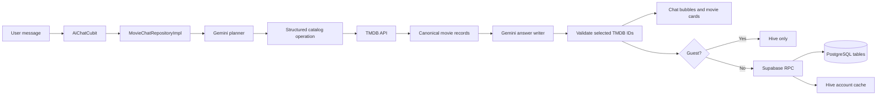
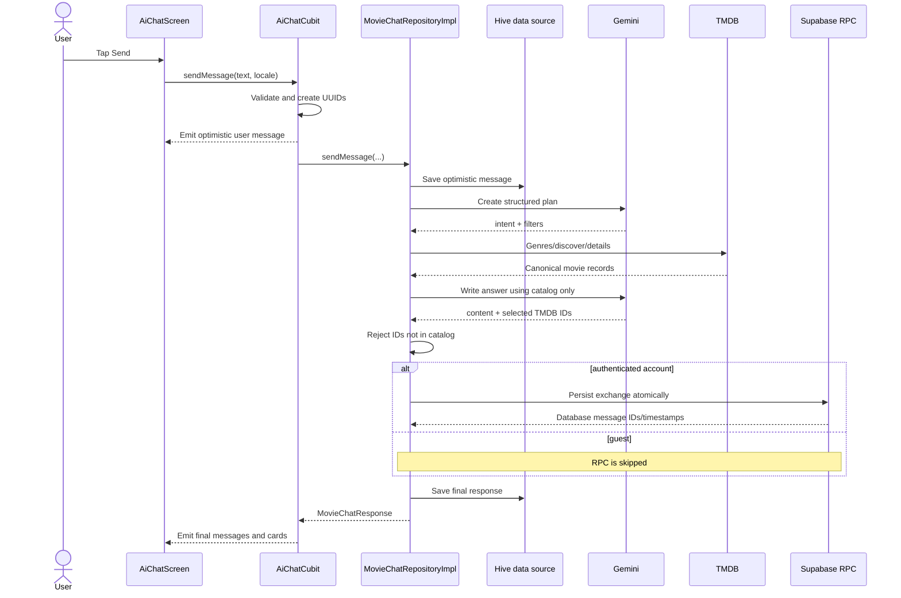
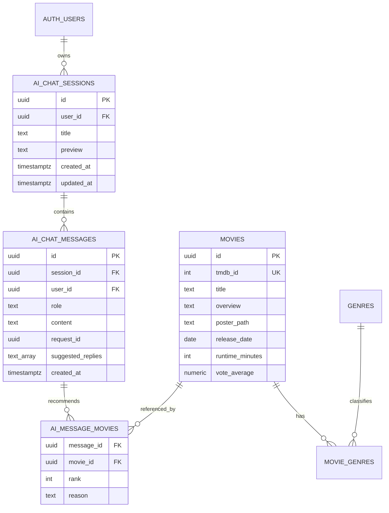

# CinMovies AI Movie Assistant — Complete Learning Guide

This guide explains how the AI feature in this project works from end to end:

- how the Flutter chat UI is built;
- how `AiChatCubit` controls the feature;
- where Gemini is called;
- where movie information comes from;
- how Gemini is prevented from inventing movie records;
- how guest and authenticated history are stored;
- what a Supabase RPC is;
- what `persist_movie_chat_exchange` does inside PostgreSQL;
- how to rebuild the feature yourself.

The explanations refer to the code that currently exists in this repository.

---

## 1. The most important mental model

The feature uses three different systems for three different jobs.

| System | Responsibility | It does **not** do |
|---|---|---|
| Gemini | Understands the question and writes the conversational answer | It is not trusted as the source of movie IDs, ratings, dates, or runtime |
| TMDB | Supplies real movie records and metadata | It does not write the natural-language answer |
| Supabase/Hive | Stores conversations and selected movie relationships | It does not generate the answer |

The active Flutter implementation follows this pipeline:



This is better than asking Gemini, “Recommend some movies and return their
details,” because a language model can invent or confuse details. In this
project, Gemini may choose only IDs that came from the current TMDB response.

---

## 2. Where every part lives

### Presentation and UI

- [`ai_chat_screen.dart`](../lib/features/ai/presentation/ai_chat_screen.dart)
  creates the Cubit, owns the text/scroll controllers, and switches between
  Chat and History.
- [`ai_chat_cubit.dart`](../lib/features/ai/presentation/cubit/ai_chat_cubit.dart)
  contains the feature state and user actions.
- [`widgets/`](../lib/features/ai/presentation/widgets/) contains the visual
  pieces such as message bubbles, the input, history tiles, and movie cards.

### Domain layer

- [`movie_chat_models.dart`](../lib/features/ai/domain/entities/movie_chat_models.dart)
  contains the plain app models.
- [`movie_chat_repository.dart`](../lib/features/ai/domain/repositories/movie_chat_repository.dart)
  defines what the presentation layer is allowed to ask the data layer to do.

### Data layer

- [`movie_chat_ai_data_source.dart`](../lib/features/ai/data/movie_chat_ai_data_source.dart)
  calls Gemini and TMDB.
- [`movie_chat_repository_impl.dart`](../lib/features/ai/data/movie_chat_repository_impl.dart)
  coordinates AI generation, remote persistence, and local caching.
- [`movie_chat_remote_data_source.dart`](../lib/features/ai/data/movie_chat_remote_data_source.dart)
  reads and writes authenticated history in Supabase.
- [`movie_chat_local_data_source.dart`](../lib/features/ai/data/movie_chat_local_data_source.dart)
  reads and writes Hive history.
- [`movie_chat_dtos.dart`](../lib/features/ai/data/models/movie_chat_dtos.dart)
  converts JSON/database rows into domain models and back.

### Configuration

- [`env_config.dart`](../lib/core/config/env_config.dart) reads environment
  values.
- [`dio_client_factory.dart`](../lib/core/network/dio_client_factory.dart)
  creates separate HTTP clients for Gemini and TMDB.
- [`injection_container.dart`](../lib/core/di/injection_container.dart) wires all
  dependencies together.

### Supabase

- [`20260728081510_secure_movie_chat.sql`](../supabase/migrations/20260728081510_secure_movie_chat.sql)
  adds chat fields, the first RPC version, indexes, permissions, and RLS.
- [`20260728081605_optimize_movie_chat_policies.sql`](../supabase/migrations/20260728081605_optimize_movie_chat_policies.sql)
  recreates the RLS policies in a more efficient form.
- [`20260728091349_serialize_chat_persistence.sql`](../supabase/migrations/20260728091349_serialize_chat_persistence.sql)
  replaces the RPC with the current concurrency-safe version.

---

## 3. How the dependencies are created

The app starts in [`main.dart`](../lib/main.dart):

1. `WidgetsFlutterBinding.ensureInitialized()` prepares Flutter plugins.
2. `EnvConfig.load()` loads `.env`.
3. `HiveCacheService.initialize()` opens the Hive boxes.
4. `SupabaseConfig.initialize()` creates the Supabase client.
5. `initDependencies()` registers repositories, data sources, and Cubits.

The AI dependency graph is:

```text
AiChatScreen
  └── AiChatCubit
      └── MovieChatRepository (MovieChatRepositoryImpl)
          ├── MovieChatAiDataSource
          │   ├── TMDB Dio client
          │   └── Gemini Dio client
          ├── MovieChatRemoteDataSource
          │   └── SupabaseDatabaseService
          └── MovieChatLocalDataSource
              └── HiveCacheService
```

The important registrations are:

```dart
serviceLocator.registerLazySingleton<MovieChatAiDataSource>(
  () => MovieChatAiDataSource(
    serviceLocator(),              // the shared TMDB Dio client
    DioClientFactory.createGemini(),
  ),
);

serviceLocator.registerLazySingleton<MovieChatRepository>(
  () => MovieChatRepositoryImpl(
    serviceLocator(), // AI source
    serviceLocator(), // Supabase source
    serviceLocator(), // Hive source
  ),
);

serviceLocator.registerFactory<AiChatCubit>(
  () => AiChatCubit(serviceLocator()),
);
```

`registerLazySingleton` means one instance is created the first time it is
requested and reused afterward. `registerFactory` creates a fresh Cubit each
time the AI screen is created.

---

## 4. The complete message sequence

Assume the user enters:

> Recommend a short science-fiction movie with no horror.

The actual sequence is:



The optimistic message makes the interface feel immediate. The user's bubble
appears before Gemini and TMDB finish.

---

## 5. The domain models

Domain models are simple Dart objects used throughout the feature.

### `MovieChatRole`

```dart
enum MovieChatRole {
  user('user'),
  assistant('assistant');
}
```

The string values match the PostgreSQL `role` column.

### `MovieChatMessage`

Represents one user or assistant message:

- `id`: UUID;
- `role`: user or assistant;
- `content`: displayed text;
- `createdAt`: UTC time;
- `recommendations`: TMDB movies selected for this answer;
- `suggestedReplies`: action chips displayed under the answer.

### `MovieRecommendation`

Combines:

- a real app `Movie`;
- a short AI-generated reason explaining why it fits.

The reason belongs to the recommendation relationship, not the movie itself.
The same movie may be recommended in different conversations for different
reasons.

### `MovieChatSession`

Represents one history row:

- `id`;
- generated `title`;
- last-message `preview`;
- `updatedAt`;
- `messageCount`.

### `MovieChatResponse`

The repository returns the user and assistant messages together so the Cubit
can replace the temporary user message ID with the database ID when necessary.

---

## 6. How the Flutter UI is implemented

The screen is composed from small widgets instead of one very large build
method.

```text
Scaffold
└── SafeArea
    └── Column
        ├── AiHeader
        │   ├── AiLogo
        │   ├── title/subtitle
        │   ├── New Chat button
        │   └── AiSegmentedTabs
        └── Expanded
            └── AnimatedSwitcher
                ├── ChatTab
                │   ├── ListView
                │   │   ├── EmptyChat
                │   │   ├── ChatMessageBubble(s)
                │   │   ├── ThinkingBubble
                │   │   └── error banner
                │   └── ChatInput
                └── HistoryTab
                    └── HistoryTile(s)
```

### `AiChatScreen`

`AiChatScreen` is a `StatelessWidget` because its job is only to provide the
Cubit:

```dart
BlocProvider(
  create: (_) => serviceLocator<AiChatCubit>()..loadHistory(),
  child: const _AiChatView(),
)
```

`_AiChatView` is stateful because it owns objects with lifecycles:

- `TextEditingController`;
- `ScrollController`;
- `_shouldAutoScroll`.

Controllers are created once and disposed in `dispose()`.

### `BlocConsumer`

`BlocConsumer` combines:

- `builder`: rebuild UI for a new state;
- `listener`: run one-time effects, here scrolling after messages/tabs change.

The listener does not rebuild widgets. It schedules scrolling after the new
list has been laid out with `WidgetsBinding.instance.addPostFrameCallback`.

### `AnimatedSwitcher`

The Chat and History bodies have different `ValueKey` values:

```dart
ChatTab(key: ValueKey('chat'))
HistoryTab(key: ValueKey('history'))
```

That tells `AnimatedSwitcher` they are different children and enables the
180-millisecond transition.

### `ChatInput`

Important widgets and choices:

- `TextField` supports one to four lines;
- `maxLength: 1000` matches Cubit and database validation;
- `ValueListenableBuilder` listens directly to the controller;
- the send button is disabled when the trimmed input is empty;
- the complete input is disabled while sending or switching conversation;
- `TextInputAction.send` allows keyboard submission.

Listening to the controller with `ValueListenableBuilder` avoids rebuilding the
entire chat screen for every typed character.

### `ChatMessageBubble`

User and assistant messages reuse one widget but change:

- alignment;
- gradient/background;
- border;
- which bottom corner has the small “speech tail” radius;
- whether the AI logo is displayed.

For assistant messages it may also render:

1. a horizontal `ListView` of `MovieRecommendationCard`;
2. a `Wrap` of suggested-reply `ActionChip` widgets.

`Flexible` plus `maxWidth: 310` prevents message bubbles from becoming too wide.

### `MovieRecommendationCard`

The movie card uses:

- `Semantics` for an accessible button description;
- `InkWell` for Material tap feedback;
- `MovieArtwork` for local/network artwork handling;
- `Hero` for the image transition into movie details;
- `MediaQuery.sizeOf(context)` plus min/max constraints for responsive width;
- `TextOverflow.ellipsis` so long titles do not break the row.

The Hero tag contains the message ID, list index, and movie ID. This makes it
unique even if the same movie appears in multiple chat answers.

### `ThinkingBubble`

This is a custom loading animation:

- three `_ThinkingDot` widgets;
- each has an `AnimationController`;
- each starts after a different `Timer` delay;
- `FadeTransition` animates opacity from `0.35` to `1`;
- `repeat(reverse: true)` creates the pulse.

The timers and controllers are cancelled/disposed to avoid memory leaks.

### `HistoryTab` and `HistoryTile`

`HistoryTab` handles three layouts:

1. centered `CircularProgressIndicator`;
2. empty-history state;
3. `ListView.separated` of sessions.

`HistoryTile` uses `Dismissible` for swipe-to-delete and also provides an
explicit delete `IconButton`. `confirmDismiss` waits for the confirmation dialog
and repository deletion before allowing the tile to disappear.

### Widget reference

| Widget | Main Flutter widgets used |
|---|---|
| `AiHeader` | `Padding`, `Column`, `Row`, `Expanded`, `AnimatedSwitcher`, `TextButton.icon` |
| `AiLogo` | `Container`, `LinearGradient`, `Icon` |
| `AiSegmentedTabs` | `Container`, `Row`, `Expanded`, `InkWell`, `AnimatedContainer` |
| `ChatTab` | `Column`, `Expanded`, `ListView` |
| `ChatInput` | `TextField`, `ValueListenableBuilder`, `IconButton` |
| `ChatMessageBubble` | `Row`, `Flexible`, `Container`, horizontal `ListView`, `Wrap`, `ActionChip` |
| `ThinkingBubble` | `AnimationController`, `FadeTransition`, `Timer` |
| `MovieRecommendationCard` | `Semantics`, `InkWell`, `Hero`, `ClipRRect`, `MovieArtwork` |
| `HistoryTab` | `CircularProgressIndicator`, `ListView.separated` |
| `HistoryTile` | `Dismissible`, `InkWell`, `IconButton` |

---

## 7. How `AiChatCubit` controls the feature

The Cubit is the screen's state machine.

### Status values

| Status | Meaning |
|---|---|
| `initial` | Cubit was just created |
| `loadingHistory` | Loading session summaries |
| `ready` | Normal interactive state |
| `sending` | Gemini/TMDB request is active |
| `sendFailure` | Sending failed and may be retried |
| `historyFailure` | Loading/deleting history failed |
| `switchingConversation` | Loading another conversation |
| `deletingSession` | A deletion is active |

### Important state fields

- `conversationId`: UUID of the current chat;
- `isGuest`: captured from the repository;
- `activeTab`: Chat or History;
- `messages`: current conversation;
- `sessions`: history summaries;
- `failure`: user-friendly error;
- `pendingSend`: everything required to retry the exact failed request.

### `sendMessage()`

This method:

1. trims the input;
2. rejects duplicate sends while already sending;
3. rejects empty or over-1,000-character messages;
4. copies the current messages as conversation context;
5. creates a UUID `requestId`;
6. creates an optimistic user message using that same UUID;
7. stores a `PendingMovieChatSend`;
8. emits `sending` and adds the optimistic bubble;
9. calls `_performSend()`.

Using one `requestId` throughout the request makes retries idempotent. More on
that in the RPC section.

### `_performSend()`

This calls the repository. On success it:

1. finds the optimistic user message;
2. replaces it with the database-confirmed user message;
3. appends the assistant message if not already present;
4. sorts messages by timestamp;
5. updates the history summary;
6. clears the retry state.

On failure, it keeps `pendingSend`, allowing `retryFailed()` to send the same
conversation ID and request ID again.

### `loadHistory()` and `loadSession()`

- `loadHistory()` requests session summaries.
- `loadSession()` changes to Chat, clears the current messages, then loads the
  selected session's messages.

### `startNewChat()`

Creates a new conversation UUID and clears the current messages. A database
session is not created yet. It is created only after the first successful
exchange is persisted.

### `deleteSession()`

Deletes the selected session through the repository. If the deleted session is
currently open, the Cubit also creates a new conversation UUID and clears the
chat.

---

## 8. Why there is a repository layer

`MovieChatRepository` is an interface:

```dart
abstract interface class MovieChatRepository {
  bool get isGuest;
  Future<Either<Failure, List<MovieChatSession>>> loadSessions();
  Future<Either<Failure, List<MovieChatMessage>>> loadMessages(String id);
  Future<Either<Failure, MovieChatResponse>> sendMessage(...);
  Future<Either<Failure, void>> deleteSession(String id);
}
```

The Cubit does not know about Dio, Supabase, Hive, JSON, or PostgreSQL. It knows
only this contract.

`Either<Failure, T>` from `dartz` means:

- `Left(Failure)` = failed result;
- `Right(T)` = successful result.

This makes failure handling explicit without throwing exceptions into the UI.

### `MovieChatRepositoryImpl.sendMessage()`

The repository performs these operations in order:

1. save the optimistic message to Hive;
2. call `MovieChatAiDataSource.generate()`;
3. prepare temporary IDs and timestamps;
4. if authenticated, call the Supabase RPC and use its returned IDs;
5. build `MovieChatResponse`;
6. save the final response to Hive;
7. return `Right(response)`;
8. convert thrown errors into `Left(Failure)` with `mapError()`.

The repository is the correct place for this coordination because neither the
UI nor a single data source should decide the complete offline/online strategy.

---

## 9. Where the Gemini functions are

The active Gemini implementation is in:

[`movie_chat_ai_data_source.dart`](../lib/features/ai/data/movie_chat_ai_data_source.dart)

There is no Gemini SDK package in the Flutter app. Gemini is called as a normal
HTTP REST API through Dio.

### Gemini client configuration

`DioClientFactory.createGemini()` creates a client with:

```dart
baseUrl: 'https://generativelanguage.googleapis.com/v1beta'
headers: {
  'Accept': 'application/json',
  'x-goog-api-key': GEMINI_API_KEY,
}
```

The model comes from `GEMINI_MODEL`, falling back to the value defined by
`EnvConfig.defaultGeminiModel`.

### `_generateJson()` is the low-level Gemini function

It posts to:

```text
/models/{model}:generateContent
```

The important request fields are:

```dart
{
  'systemInstruction': {
    'parts': [{'text': systemInstruction}]
  },
  'contents': [{
    'role': 'user',
    'parts': [{'text': prompt}]
  }],
  'generationConfig': {
    'responseMimeType': 'application/json',
    'responseJsonSchema': schema,
    'maxOutputTokens': 2048,
    'temperature': 0.25,
  },
}
```

Why these choices matter:

- `application/json` requests structured output;
- `responseJsonSchema` constrains the JSON shape;
- low temperature makes output more consistent;
- the app validates the JSON again after receiving it.

Gemini's HTTP response contains candidates. `_geminiText()` extracts:

```text
candidates[0].content.parts[0].text
```

That text is decoded with `jsonDecode`.

### Gemini is called twice

#### Call 1: `_createPlan()`

The planner receives:

- locale;
- current year;
- up to ten recent messages;
- the user's new message.

It returns:

- `intent`;
- a structured catalog `operation`.

Possible intents:

- `recommendation`;
- `movie_question`;
- `comparison`;
- `similar`;
- `clarification`;
- `off_topic`.

The operation can contain:

- named movie titles;
- `similarTo`;
- included and excluded genres;
- original language;
- year range;
- minimum rating;
- maximum runtime;
- free-form preference notes;
- whether movies from conversation context should be reused.

Example conceptual plan:

```json
{
  "intent": "recommendation",
  "operation": {
    "titles": [],
    "genres": ["Science Fiction"],
    "excludedGenres": ["Horror"],
    "maxRuntimeMinutes": 110,
    "preferenceNotes": "short and accessible",
    "useContextMovies": false
  }
}
```

Gemini does not select final movie records at this step. It describes how the
app should query TMDB.

#### Call 2: `_createAnswer()`

After TMDB returns canonical movies, the app sends Gemini:

- the intent;
- the structured operation;
- recent conversation;
- user message;
- `canonicalCatalog`, containing trusted TMDB records.

Gemini returns:

```json
{
  "content": "Here are a few short science-fiction choices...",
  "selectedMovies": [
    {"tmdbId": 123, "reason": "Fits the runtime and avoids horror."}
  ],
  "suggestedReplies": [
    "Make it more comedic",
    "Show only movies after 2020"
  ]
}
```

The app builds a map of `catalog ID -> canonical movie`. If Gemini returns a
TMDB ID that is not in that map, the selection is ignored.

### Function reference for the AI data source

| Function | Responsibility |
|---|---|
| `generate()` | Complete planner → TMDB → answer pipeline |
| `_createPlan()` | First structured Gemini request |
| `_loadCatalog()` | Execute the plan using TMDB |
| `_matches()` | Reapply strict filters to resolved movie details |
| `_createAnswer()` | Second structured Gemini request |
| `_generateJson()` | Low-level Gemini REST call and error handling |
| `_isNetworkFailure()` | Distinguish connectivity errors |
| `_geminiText()` | Extract JSON text from Gemini candidates |
| `_contextJson()` | Send compact recent conversation context |
| `_shortString()` | Trim and bound model-generated strings |
| `_boundedInteger()` / `_boundedDouble()` | Reject out-of-range planner values |
| `_tmdbLocale()` | Normalize Flutter locale for TMDB |

---

## 10. Where the movies come from

The movie data comes from **TMDB**, not Gemini and not Supabase.

The TMDB client uses:

```text
Base URL: https://api.themoviedb.org/3
Authorization: Bearer {TMDB v4 read access token}
```

The token is loaded from `TMDB_API_KEY`.

### Endpoints used by the AI pipeline

| Endpoint | Why it is called |
|---|---|
| `/genre/movie/list` | Convert genre names such as “Science Fiction” into TMDB genre IDs |
| `/search/movie` | Resolve a named movie |
| `/movie/{id}/similar` | Find candidates similar to a named seed movie |
| `/discover/movie` | Search by genre, language, date, rating, and runtime |
| `/movie/{id}` | Load the canonical detail record |

The detail request adds:

```text
append_to_response=release_dates
```

This allows `_CanonicalMovie` to derive a certification/age rating.

### `_loadCatalog()` in detail

1. Normalize the locale, for example `en` → `en-US`.
2. Download TMDB genre definitions.
3. If `similarTo` exists:
   - search for the seed title;
   - use its first result;
   - call its similar-movies endpoint.
4. Search every named title from the plan.
5. If it is a general recommendation, call Discover with the filters.
6. Add referenced movie IDs from recent conversation when requested.
7. Deduplicate IDs.
8. Load full details for at most eight IDs in parallel with `Future.wait`.
9. Convert each result into `_CanonicalMovie`.
10. Reapply exclusion/runtime/rating/year/language filters.

Reapplying the filters is important. Search/discover responses and model plans
should not be trusted blindly.

### `_CanonicalMovie`

This private model stores the normalized TMDB record:

- TMDB integer ID;
- title/original title;
- overview;
- poster/backdrop path;
- release date;
- runtime;
- certification;
- rating/vote count/popularity;
- original language;
- genre names.

It provides two JSON shapes:

- `promptJson`: compact facts sent to Gemini;
- `movieJson`: fields passed into `TmdbMovieMapper`.

### `TmdbMovieMapper`

[`tmdb_movie_mapper.dart`](../lib/features/home/data/tmdb_movie_mapper.dart)
converts the TMDB-shaped map into the app's shared `Movie` entity.

For images it turns a relative path such as:

```text
/abc123.jpg
```

into:

```text
https://image.tmdb.org/t/p/w500/abc123.jpg
```

That `Movie` object is what `MovieRecommendationCard` displays and what is sent
to the Movie Details route.

---

## 11. DTOs: why another model layer exists

Domain models should not know every JSON or database field name. DTOs handle
that translation.

### `MovieChatMessageDto.fromJson()`

Used for local JSON:

- validates UUID;
- parses `role`;
- parses UTC timestamp;
- parses optional recommendations;
- accepts snake_case or camelCase names;
- limits suggested replies.

### `MovieChatMessageDto.fromDatabaseRow()`

Supabase returns nested relations:

```text
ai_chat_messages
  └── ai_message_movies
      └── movies
          └── movie_genres
              └── genres
```

This factory:

1. sorts recommendation relations by `rank`;
2. extracts the movie row;
3. flattens genre relations into names;
4. changes database `tmdb_id` into the mapper's expected `id`;
5. forwards the normalized result to `fromJson()`.

### Defensive parsing

Malformed recommendations/messages are skipped individually. One bad movie card
does not destroy the whole answer, and one damaged cached message does not
destroy the complete history.

---

## 12. Guest versus authenticated storage

| Behavior | Guest | Authenticated account |
|---|---|---|
| Generate Gemini answer | Yes | Yes |
| Query TMDB | Yes | Yes |
| Store history in Hive | Yes, scope `guest` | Yes, scope `user:{userId}` |
| Store history in Supabase | No | Yes |
| Load remote history first | No | Yes |
| Offline history fallback | Hive | Hive account cache |

`MovieChatRemoteDataSource.scopeId` returns:

```dart
return user == null || user.isAnonymous
    ? 'guest'
    : 'user:${user.id}';
```

This prevents one account's cache from being shown to another account.

### Hive key

`HiveCacheService` stores all sessions for a scope under:

```text
{scopeId}::sessions
```

Examples:

```text
guest::sessions
user:550e8400-e29b-41d4-a716-446655440000::sessions
```

The stored session JSON also contains its messages. `MovieChatLocalDataSource`
rebuilds title, preview, updated time, and message count whenever a response is
saved.

### Authenticated offline strategy

When loading history:

1. try Supabase;
2. replace the matching Hive cache;
3. return remote data.

If Supabase fails:

1. read the matching Hive cache;
2. return it when non-empty;
3. otherwise return the mapped failure.

---

## 13. What is a Supabase RPC?

RPC means **Remote Procedure Call**.

In Supabase, an RPC is normally a PostgreSQL function exposed through
PostgREST. Flutter calls the function by name and sends named parameters.

Flutter code:

```dart
final result = await supabase.rpc(
  'persist_movie_chat_exchange',
  params: {
    'p_session_id': conversationId,
    'p_request_id': requestId,
    'p_user_content': userContent,
    'p_assistant_content': draft.content,
    'p_suggested_replies': draft.suggestedReplies,
    'p_movies': moviesJson,
  },
);
```

Conceptually, PostgREST makes PostgreSQL execute:

```sql
select public.persist_movie_chat_exchange(
  p_session_id := ...,
  p_request_id := ...,
  ...
);
```

You use an RPC when an operation is more than a simple insert/update and must
remain consistent.

Without the RPC, Flutter would need to:

1. insert/update a session;
2. insert the user message;
3. insert the assistant message;
4. upsert each movie;
5. insert every movie-message relation;
6. update the session preview.

If request 4 failed, the database could contain a partial conversation. The RPC
runs all steps as one database operation. If it raises an error, PostgreSQL
rolls the operation back.

---

## 14. The chat database structure



Why there is a junction table:

- one assistant message can recommend many movies;
- one movie can appear in many assistant messages;
- `rank` preserves card order;
- `reason` is specific to this recommendation.

---

## 15. `persist_movie_chat_exchange` explained step by step

The current definition is in
[`20260728091349_serialize_chat_persistence.sql`](../supabase/migrations/20260728091349_serialize_chat_persistence.sql).

### Function signature

```sql
create or replace function public.persist_movie_chat_exchange(
  p_session_id uuid,
  p_request_id uuid,
  p_user_content text,
  p_assistant_content text,
  p_suggested_replies text[] default '{}',
  p_movies jsonb default '[]'::jsonb
)
returns jsonb
language plpgsql
```

Conventions:

- `p_` means parameter;
- `v_` means local variable;
- `jsonb` stores structured JSON efficiently in PostgreSQL;
- `text[]` is a PostgreSQL string array;
- `plpgsql` enables variables, conditions, loops, and exceptions.

### Step 1: identify and authorize the caller

```sql
v_user_id uuid := auth.uid();
v_is_anonymous boolean :=
  coalesce((auth.jwt() ->> 'is_anonymous')::boolean, false);
```

- `auth.uid()` reads the current Supabase user ID from the JWT.
- `auth.jwt()` reads JWT claims.
- `->>` extracts a JSON value as text.
- `::boolean` casts it.
- `coalesce(value, false)` supplies a default for null.

The function rejects logged-out and anonymous users:

```sql
if v_user_id is null or v_is_anonymous then
  raise exception 'Authenticated account required'
    using errcode = '42501';
end if;
```

Guest history therefore cannot accidentally be written to Supabase.

### Step 2: validate the input

The function checks:

- IDs are present;
- messages are not empty;
- user message is at most 1,000 characters;
- `p_movies` is an array;
- at most five movies are supplied.

`22023` means invalid parameter value.

Client validation improves UX, but server validation is still necessary
because a malicious client can bypass Flutter code.

### Step 3: lock this exact request

```sql
perform pg_advisory_xact_lock(
  hashtextextended(
    p_session_id::text || ':' || p_request_id::text,
    0
  )
);
```

This creates a transaction-level advisory lock derived from the session ID and
request ID.

If the user taps retry twice and the same request reaches PostgreSQL
concurrently:

- the first call gets the lock;
- the second call waits;
- after the first finishes, the second sees the saved response and returns it.

The lock is automatically released when the transaction finishes.

### Step 4: idempotency check

The function searches for an assistant message with the same:

- session ID;
- request ID;
- role;
- owner.

If it already exists, the function returns the existing message IDs and
timestamps instead of inserting duplicates.

This behavior is called **idempotency**: retrying the same logical operation has
the same result.

The unique index also protects the data:

```sql
create unique index ...
on ai_chat_messages (session_id, request_id, role);
```

### Step 5: create or verify the session

The title is the first 60 characters of the first user message:

```sql
v_title := left(trim(p_user_content), 60);
```

The function inserts the session with `on conflict (id) do nothing`. It then
checks that the session belongs to the current user. A user cannot reuse another
user's conversation ID.

### Step 6: insert both messages

The function inserts:

1. the user message;
2. the assistant message, including suggested replies.

`returning * into v_user_message` stores the generated UUID and timestamp in a
PL/pgSQL row variable.

### Step 7: process recommended movies

`jsonb_array_elements(p_movies)` turns the JSON array into rows. The `for` loop
processes each item.

Each item must:

- be a JSON object;
- have a positive TMDB ID;
- have a non-empty title.

Then the function calls another RPC:

```sql
v_movie_id := public.cache_movie(...);
```

After receiving the internal movie UUID, it inserts:

```text
assistant message ID + movie ID + rank + reason
```

into `ai_message_movies`.

### Step 8: update session summary

The preview becomes the first 240 characters of the assistant answer and
`updated_at` becomes `now()`. This makes recent conversations sort first.

### Step 9: return IDs and timestamps

The JSON response is:

```json
{
  "userMessageId": "database UUID",
  "userCreatedAt": "database timestamp",
  "assistantMessageId": "database UUID",
  "assistantCreatedAt": "database timestamp"
}
```

`PersistedMovieChatExchange.fromJson()` validates this result in Dart.

---

## 16. What `cache_movie` does

`persist_movie_chat_exchange` needs database movie UUIDs, but the AI pipeline
knows TMDB integer IDs. `cache_movie` bridges that difference.

It:

1. requires an authenticated caller;
2. inserts a row into `movies`;
3. if `tmdb_id` already exists, updates its current metadata;
4. keeps old optional fields when a new optional value is null;
5. inserts/updates genre rows;
6. inserts `movie_genres` junction rows;
7. returns the internal `movies.id` UUID.

This means Supabase stores one reusable movie row per TMDB ID rather than
duplicating a complete movie object in every message.

`cache_movie` is also called by the regular
[`MovieRepository`](../lib/features/movies/data/movie_repository.dart), so movie
storage uses a shared database format.

---

## 17. Permissions and Row Level Security

An RPC name is not a security boundary by itself. The migrations apply multiple
layers.

### Function privileges

The migration:

```sql
revoke all on function ... from public, anon;
grant execute on function ... to authenticated;
```

So the public and unauthenticated database roles cannot call the persistence
function.

### Function-level check

The function independently rejects:

- `auth.uid() is null`;
- JWTs where `is_anonymous` is true.

### RLS policies

Policies ensure the current user owns each row.

For a session:

```sql
(select auth.uid()) = user_id
and not coalesce(
  ((select auth.jwt()) ->> 'is_anonymous')::boolean,
  false
)
```

For `ai_message_movies`, ownership is checked through its parent message with
`exists (...)`.

The second migration changes `auth.uid()` into `(select auth.uid())`. Supabase's
PostgreSQL planner can evaluate that once per statement instead of unnecessarily
re-evaluating it for every row.

Security must exist in PostgreSQL even when Flutter already filters by
`user_id`, because client-side filters can be changed by an attacker.

---

## 18. Why there are three chat migrations

Migrations are an ordered history, not three independent RPCs.

1. `20260728081510_secure_movie_chat.sql`
   - adds `request_id`, `suggested_replies`, and recommendation `reason`;
   - creates indexes;
   - creates the first RPC;
   - creates permanent-account RLS policies.
2. `20260728081605_optimize_movie_chat_policies.sql`
   - drops and recreates the same policies with optimized auth expressions.
3. `20260728091349_serialize_chat_persistence.sql`
   - uses `create or replace function`;
   - replaces the RPC body with the advisory-lock version.

After all migrations are applied, PostgreSQL uses the latest function
definition from the third migration.

Never delete old applied migrations merely because a later one replaces a
function. A new database needs the complete ordered history unless you create a
carefully tested baseline migration.

---

## 19. Reading authenticated history from Supabase

### Session summaries

`loadSessions()` selects:

```text
id, title, preview, updated_at, ai_chat_messages(id)
```

The nested message IDs are counted in Dart to create `messageCount`.

It filters by the current user and sorts by `updated_at descending`.

### Full messages

`loadMessages(sessionId)` requests messages and nested movie relationships:

```text
ai_chat_messages
  -> ai_message_movies(reason, rank)
     -> movies(...)
        -> movie_genres
           -> genres(name)
```

It filters by both `session_id` and `user_id` and sorts by `created_at`.
RLS remains the real authorization boundary.

---

## 20. Error and retry behavior

### UI validation

The Cubit rejects:

- empty text;
- text over 1,000 characters;
- another send while sending.

### Gemini errors

`_generateJson()`:

- rethrows connection/time-out Dio errors so the global mapper can display a
  network message;
- maps HTTP 429 to “assistant is busy”;
- maps other service errors to temporary unavailability;
- maps invalid JSON/shape to an invalid-response message.

### Retry

`PendingMovieChatSend` stores:

- request ID;
- conversation ID;
- optimistic message;
- locale;
- the exact previous context.

Retrying therefore does not create a new logical message. The RPC's advisory
lock and idempotency lookup make repeated network attempts safe.

### Cache failure after successful RPC

If Supabase already saved an authenticated exchange but updating Hive fails,
the repository still returns the answer. A future remote history refresh can
rebuild the account cache.

For guests, Hive is the only storage, so a Hive save failure is treated as a
real failure.

---

## 21. Important: Dart functions, RPCs, and Edge Functions are different

The word “function” is used for three different concepts here.

### Dart functions

Examples:

- `MovieChatAiDataSource.generate()`;
- `_createPlan()`;
- `_generateJson()`;
- `AiChatCubit.sendMessage()`.

These run inside the Flutter application.

### PostgreSQL functions / RPCs

Examples:

- `persist_movie_chat_exchange`;
- `cache_movie`.

These run inside the Supabase PostgreSQL database and are called with
`supabase.rpc(...)`.

### Supabase Edge Functions

These are server-side TypeScript/Deno HTTP functions and are normally invoked
with `supabase.functions.invoke(...)`.

At the time this guide was written, the connected Supabase project had deployed
functions named `movie-chat` and `tmdb-proxy`. However, the current Flutter
source does **not** contain a `functions.invoke` call. Therefore those deployed
functions are not part of the active Flutter request path described above.

The active source path is:

```text
Flutter -> Gemini REST
Flutter -> TMDB REST
Flutter -> Supabase RPC (history only)
```

Do not debug the deployed `movie-chat` Edge Function when a request from the
current `MovieChatAiDataSource` fails; inspect the Dart Dio requests instead.

---

## 22. Security warning for a production app

`.env` is ignored by Git, which prevents accidentally committing keys.
However, Flutter bundles declared assets into the compiled application. A user
can extract client-bundled Gemini and TMDB keys.

The current direct-client architecture is appropriate for learning and local
development, as also noted in the project README.

For production:

1. put Gemini and TMDB secrets in Supabase Edge Function secrets;
2. invoke a JWT-protected Edge Function from Flutter;
3. authenticate and rate-limit on the server;
4. validate request and response schemas on the server;
5. keep the PostgreSQL RPC for atomic persistence;
6. never put a Supabase service-role key in Flutter.

The already deployed `movie-chat` function demonstrates an alternate
server-side approach, but its source should be versioned and intentionally wired
into Flutter before treating it as the production path.

---

## 23. How to rebuild this feature yourself

Build it in small stages. Do not start with the complete RPC and polished UI.

### Stage 1: build static chat UI

1. Create `MovieChatMessage`.
2. Create `ChatMessageBubble`.
3. Display hardcoded user and assistant messages in a `ListView`.
4. Add `ChatInput`.
5. Add a fake horizontal movie card list.

Success criterion: the complete chat UI works with no network.

### Stage 2: add Cubit state

1. Create `AiChatStatus`.
2. Create `AiChatState`.
3. Move the message list into the state.
4. Implement input validation.
5. Add optimistic user messages.
6. Add a fake delayed assistant response.

Success criterion: loading, failure, retry, and new-chat states work.

### Stage 3: define the repository contract

Create `MovieChatRepository` and make the Cubit depend only on it. Start with an
in-memory implementation.

Success criterion: the Cubit test does not import Dio, Hive, or Supabase.

### Stage 4: call one Gemini prompt

1. Create a Gemini Dio client.
2. Send one structured JSON request.
3. Parse `candidates[0].content.parts[0].text`.
4. Validate the result.
5. Map errors.

Success criterion: a text-only answer appears in the assistant bubble.

### Stage 5: split planner and answer

1. Create an intent/operation schema.
2. Ask Gemini for a search plan.
3. Print/log the plan during development.
4. Keep the final answer call separate.

Success criterion: Gemini returns filters instead of invented movie objects.

### Stage 6: integrate TMDB

1. Download genre IDs.
2. Implement title search.
3. Implement similar search.
4. Implement Discover filters.
5. Resolve full detail records.
6. create `_CanonicalMovie`.
7. reapply constraints locally.

Success criterion: every displayed movie ID exists in a current TMDB response.

### Stage 7: ground the final Gemini answer

1. Send canonical records into the final prompt.
2. Require selected TMDB IDs.
3. Reject IDs not present in the catalog map.
4. Convert valid records with `TmdbMovieMapper`.

Success criterion: Gemini controls wording, while TMDB controls facts/cards.

### Stage 8: add Hive

1. Open a chat-history Hive box.
2. Create DTO `toJson/fromJson`.
3. Save optimistic messages.
4. Replace them with final responses.
5. create guest/account cache scopes.

Success criterion: guest conversations survive app restart.

### Stage 9: create Supabase tables

Create:

- sessions;
- messages;
- message-movie junction;
- reusable movie catalog tables if not already present.

Add foreign keys, checks, indexes, and RLS before connecting Flutter.

### Stage 10: create the RPC

Start with:

1. caller check;
2. input validation;
3. session insert;
4. two message inserts;
5. return IDs.

Then add:

6. movie upsert;
7. junction rows;
8. preview update;
9. unique request index;
10. advisory lock and idempotency lookup.

### Stage 11: authenticated remote/local strategy

1. authenticated reads try Supabase;
2. successful reads update Hive;
3. failed reads fall back to Hive;
4. guest reads/writes use Hive only.

### Stage 12: finish interaction polish

Add:

- auto-scroll that respects manual user scrolling;
- thinking animation;
- suggested prompts/replies;
- Hero movie navigation;
- swipe and button deletion;
- Semantics/live-region error announcements.

---

## 24. How to debug each layer

### UI problem

Inspect:

- `AiChatScreen`;
- the active `AiChatState`;
- `ChatTab` widget inputs;
- controller disposal and scroll state.

### Message sends but no answer

Inspect:

1. Cubit state changes;
2. `MovieChatRepositoryImpl.sendMessage`;
3. Dio error from `_generateJson`;
4. `.env` Gemini key/model;
5. parsed `candidates` shape.

### Answer text works but movie cards are empty

Inspect:

1. planner operation;
2. TMDB candidate IDs;
3. resolved `_CanonicalMovie` list;
4. Gemini `selectedMovies`;
5. whether selected IDs exist in the `byId` catalog map;
6. DTO/mapper parsing.

### Guest history missing

Inspect:

- `scopeId == 'guest'`;
- Hive chat box initialization;
- `cacheMovieChatSessions`;
- DTO UUID and timestamp validation.

### Authenticated history not saved

Inspect:

1. current Supabase user;
2. `MovieChatRemoteDataSource.persistExchange`;
3. RPC parameter names;
4. function permissions;
5. function input exceptions;
6. RLS policies;
7. `cache_movie`;
8. foreign-key failures.

### Duplicate messages

Verify:

- the same retry keeps the same `requestId`;
- the unique index exists;
- the advisory-lock RPC migration is applied;
- a retry is not generating a new `PendingMovieChatSend`.

---

## 25. Existing tests and what they teach

| Test file | What it verifies |
|---|---|
| [`movie_chat_ai_data_source_test.dart`](../test/features/ai/data/movie_chat_ai_data_source_test.dart) | Planner, TMDB grounding, and answer generation |
| [`movie_chat_dtos_test.dart`](../test/features/ai/data/movie_chat_dtos_test.dart) | JSON/database mapping and malformed data |
| [`movie_chat_local_data_source_test.dart`](../test/features/ai/data/movie_chat_local_data_source_test.dart) | Local scope isolation and optimistic ID replacement |
| [`movie_chat_repository_impl_test.dart`](../test/features/ai/data/movie_chat_repository_impl_test.dart) | Guest vs authenticated persistence and cache fallback |
| [`ai_chat_cubit_test.dart`](../test/features/ai/presentation/cubit/ai_chat_cubit_test.dart) | Validation, optimistic UI, retry, duplicate-send prevention |
| [`chat_tab_test.dart`](../test/features/ai/presentation/widgets/chat_tab_test.dart) | Empty and rendered chat UI behavior |

When rebuilding the feature, write each test at the stage where its behavior is
introduced. Tests are easier to understand when they grow alongside the code.

---

## 26. Short explanation for an interviewer

> I implemented the movie assistant with a grounded two-pass AI pipeline. The
> first Gemini call converts the user's natural-language request into a
> structured TMDB query plan. The app executes that plan against TMDB and
> resolves canonical movie details. A second Gemini call writes the answer but
> can select only TMDB IDs included in that catalog, and the client validates
> those IDs again. The UI uses Flutter Bloc with optimistic messages, retry
> state, responsive movie cards, and local history. Guest history stays in
> Hive. Authenticated history is persisted with one idempotent PostgreSQL RPC
> that atomically writes the session, both messages, cached movie records, and
> recommendation relationships under RLS protection.

---

## 27. Glossary

| Term | Meaning in this project |
|---|---|
| Grounding | Restricting AI movie facts/selections to current TMDB records |
| Canonical movie | Validated normalized movie record from TMDB |
| Structured output | Gemini JSON constrained by a schema |
| DTO | Object that translates JSON/database shapes to domain models |
| Optimistic UI | Showing the user message before the network completes |
| Repository | Boundary that hides data-source details from the Cubit |
| RPC | Calling a PostgreSQL function remotely through Supabase/PostgREST |
| RLS | PostgreSQL policies deciding which rows a user may access |
| Idempotency | Retrying the same request without creating duplicates |
| Advisory lock | PostgreSQL application-defined lock used to serialize a request |
| Junction table | Table representing a many-to-many relationship |
| Hive scope | Storage namespace such as `guest` or `user:{id}` |
| Edge Function | Server-side Deno/TypeScript HTTP function, different from RPC |

---

## 28. Final summary

Follow one message through the code in this order:

```text
ChatInput
  -> AiChatScreen._sendMessage
  -> AiChatCubit.sendMessage
  -> MovieChatRepositoryImpl.sendMessage
  -> MovieChatAiDataSource.generate
       -> Gemini planner
       -> TMDB catalog
       -> Gemini answer
  -> guest: Hive
     account: persist_movie_chat_exchange RPC + Hive
  -> AiChatCubit._performSend
  -> ChatMessageBubble + MovieRecommendationCard
```

If you understand that path, you understand the complete AI feature.
